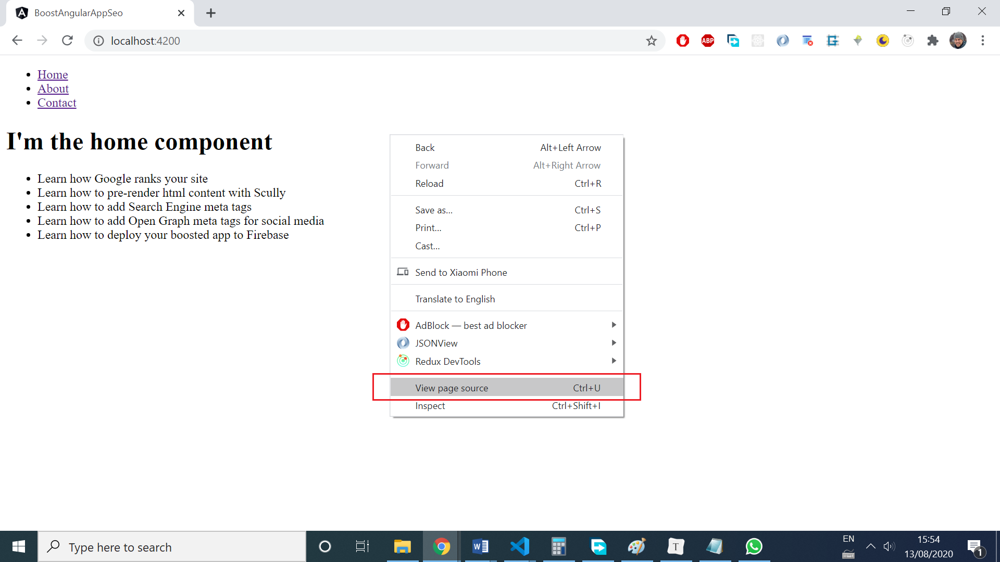
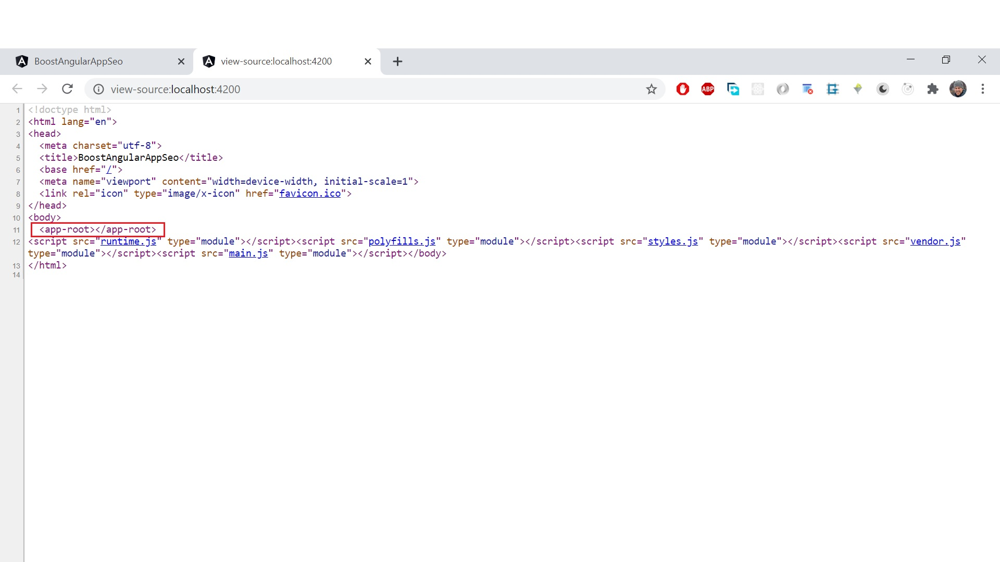
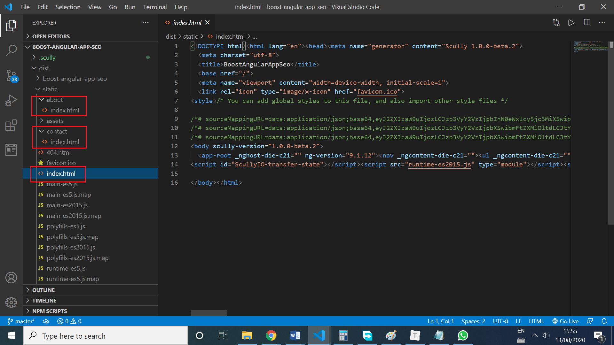
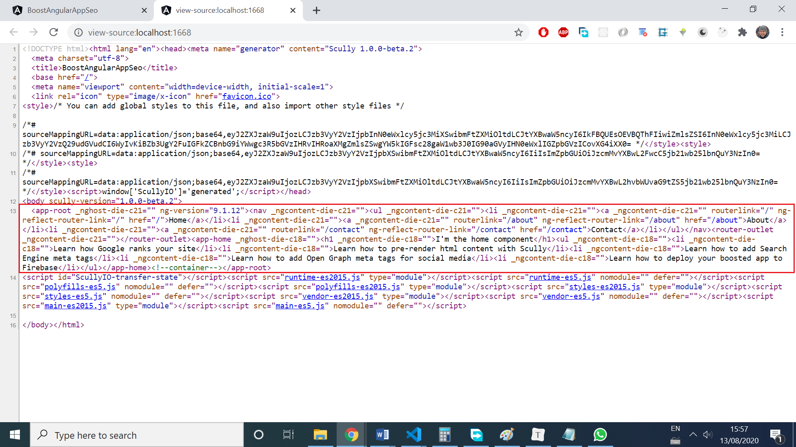
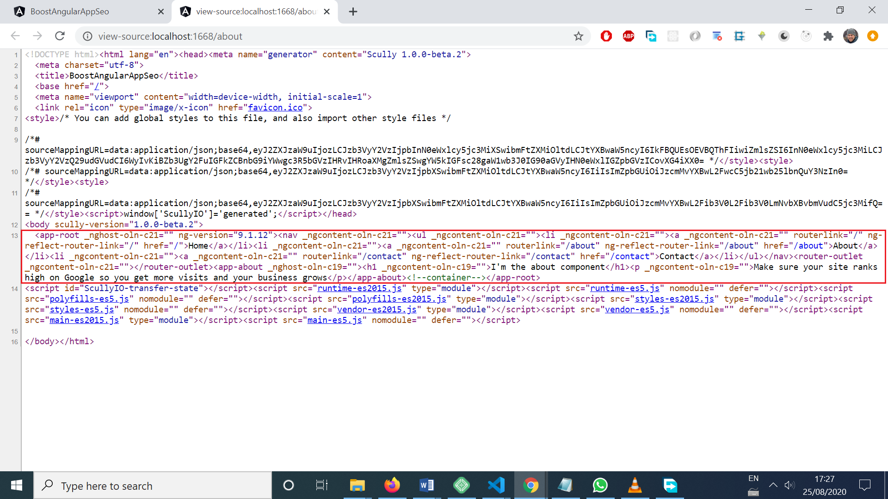
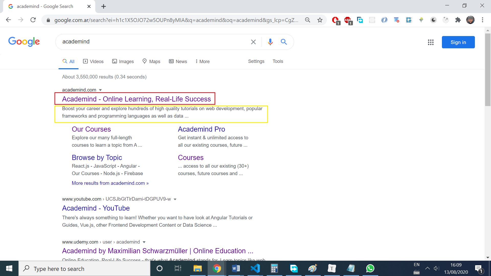
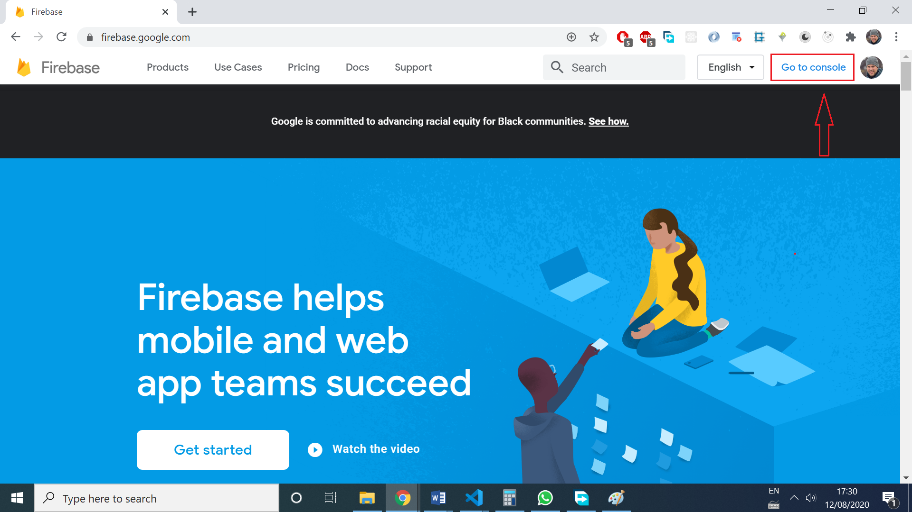
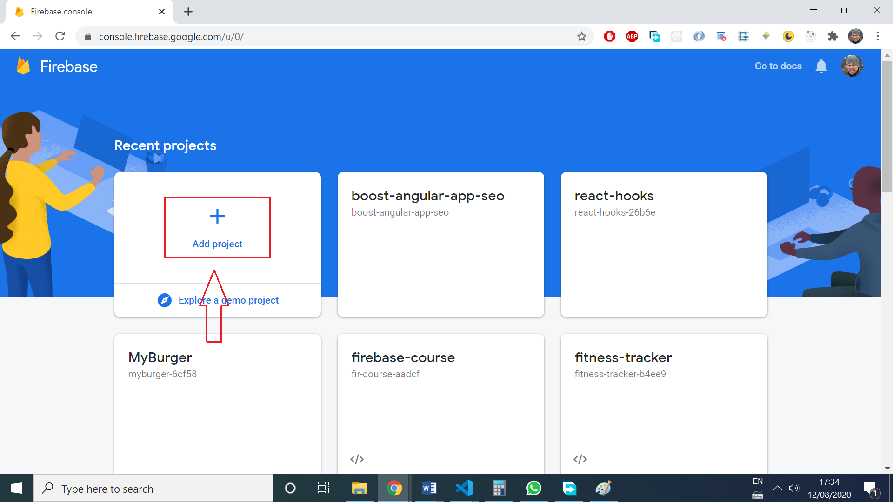

# **How to boost Angular Apps SEO**

Tags: Angular, SEO, Static Site Generators, Scully, Firebase

Table of contents:

* [Understanding Google search](#understanding-google-search)

* [Making changes to our Angular App](#making-changes-to-our-angular-app)
* [Deploy our boosted app to Firebase](#deploy-our-boosted-app-to-firebase)

**Have you ever deployed your Angular App and wondered why it didn’t show up on google search results?**

Let's explore together how Google search works, how to change an Angular app to rank higher on search engines, and how to deploy the boosted app to Firebase.


## **Understanding Google search**

First of all, let’s understand how google sorts the search results: 

According to Google, they follow three basic steps to generate results from web pages:

> ###### **Crawling**

> Once Google discovers a page URL, it visits, or _crawls_, the page to **find out what's on it** (using bots). Google **renders the page and analyzes both the text and non-text content and overall visual layout** to decide where it should appear in Search results. **The better that Google can understand your site, the better we can match it to people who are looking for your content.

> ###### **Indexing**

> After a page is discovered, Google tries to understand what the page is about. This process is called indexing. Google **analyzes the content of the page, catalogs images and video files embedded on the page, and otherwise tries to understand the page**. This information is stored in the Google index, a huge database stored in many, many (many!) computers.

> ###### **Serving (and ranking)**

> When a user types a query, Google tries to find the most relevant answer from its index based on many factors. Google tries to determine the highest quality answers, and factor in other considerations that will provide the best user experience and most appropriate answer, by considering things such as the user's location, language, and device (desktop or phone). For example, searching for "bicycle repair shops" would show different answers to a user in Paris than it would to a user in Hong Kong. Google doesn't accept payment to rank pages higher, and ranking is done programmatically.

More info about this [here](https://support.google.com/webmasters/answer/70897?hl=en#:~:text=Indexing,tries%20to%20understand%20the%20page).


## **Making changes to our Angular App**

Now that we know the 3 main steps Google uses to position search results, let ‘s see what changes can be done to Angular apps to rank higher. There are 2 changes we can make to improve SEO:  prerender HTML content for each route and add HTML tags.

#### **Change#1: Prerender html content for each route**

To learn how to pre-render content, let’s create a **simple project with 3 routes: ‘/home’, ‘/about’ and ‘/contact’**. The finished project can be found on [this gitHub repo]( https://github.com/estebanmunchjones2019/boost-angular-app-seo).

Follow the steps below to create the app together:

Install the Angular CLI globally with the following command:

```bash
npm install -g @angular/cli
```

Then, create a new application. We can name it "boost-angular-app-seo":

```bash
ng new boost-angular-app-seo
```

Then, create 3 components with the CLI as follows:

```bash
ng generate component home
ng generate component about
ng generate component contact
```

Then, configure the routes in app.routing.module.ts file like this:

````typescript
// app.routing.module.ts

import { NgModule } from '@angular/core';
import { Routes, RouterModule } from '@angular/router';

import { HomeComponent } from './home/home.component';
import { AboutComponent } from './about/about.component';
import { ContactComponent } from './contact/contact.component';

const routes: Routes = [
 { path: '', component: HomeComponent, pathMatch: 'full' },
 { path: 'about', component: AboutComponent }, 
 { path: 'contact', component: ContactComponent },
 { path: '**', redirectTo: '' }
];

@NgModule({
 imports: [RouterModule.forRoot(routes)],
 exports: [RouterModule]
})

export class AppRoutingModule { }
````

 Then, add the following HTML to the following files:

```html
//app.component.html

<nav>
  <ul>
    <li>
      <a routerLink="/">Home</a>
    </li>
    <li>
      <a routerLink="/about">About</a>
    </li>
    <li>
      <a routerLink="/contact">Contact</a>
    </li>
  </ul>
</nav>
<router-outlet></router-outlet>

```


```html
//home.component.html

<h1>I'm the home component</h1>
<ul>
    <li>Learn how Google ranks your site</li>
    <li>Learn how to pre-render html content with Scully</li>
    <li>Learn how to add Search Engine meta tags</li>
    <li>Learn how to add Open Graph meta tags for social media</li>
    <li>Learn how to deploy your boosted app to Firebase</li>
</ul>

```


```html
//about.component.html

<h1>I'm the about component</h1>
<p>Make sure your site ranks high on Google so you get more visits
 and your business grow</p>

```


```html
//contact.component.html

<h1>I'm the contact component</h1>
<p>Want to contact us? Please join us on our Discord channel: 
    <a href="https://discord.com/invite/gxvEWGU"></a> 
</p>

```

Let’s now serve the app with:

 ```bash
ng serve
 ```

and explore the content of the ‘/home’ route by clicking "view source code":





Not much content for Google when visiting our page, uh? We only have 

```html
<app-root></app-root>
```

with any content inside, and some scripts at the bottom. 

Angular apps are SPAs (Single Page Applications) and the content inside <app-root></app-root> is rendered at runtime; in other words: the browser runs the Angular bundled JavaScript files and then, renders the HTML content.

Relying on Google bots executing our JavaScript to finally see the content is not the best way. So, the objective now is to pre-render each route’s HTML content, so bots can instantly see it, without the need of executing any JavaScript.

##### **Scully to the rescue**

This task of pre-rendering the HTML content can be done using [Scully](https://scully.io/), a static site generator which analyzes the route structure of our compiled Angular application and generates a static version of each page. Sounds a bit confusing at first, but it's not in the end.

How to add Scully to the project?

First, check the software requirements:

* Angular versions: **v8.x.x** and **v9.x.x**
* Node.js: **10** or higher.
* Chromium: **IMPORTANT:** *Scully uses Chromium. Therefore, your Operating System, as well as its administrator rights must allow its installation and execution.*

Make sure you meet all those requirements when building the app on your machine. Our demo app already has a routing.config.module.ts file, which is pre-requisite for Scully. **If you don’t have it in your project**, you can create one with the following command: 

```bash
ng generate module app-routing --flat --module=app
```

Now, it’s time to add Scully:

````bash
ng add @scullyio/init
````

**NOTE**: After installation, **if you were serving the app during the installation**, you need to restart  the server with:

`````bash
ng serve
`````

After adding Scully,  we have a config file named scully.<projectName>.config.ts, where the projectName is the name of our Angular project. For this demo app, this file looks like this:

````typescript
// scully.boost-angular-app-seo.config.ts

import { ScullyConfig } from '@scullyio/scully';
export const config: ScullyConfig = {
  projectRoot: "./src",
  projectName: "boost-angular-app-seo",
  outDir: './dist/static',
  routes: {
  }
};

````

Even with this basic config, we are now ready to build our Angular app using Scully for the first time!

**NOTE**: It is important to know that any routes in the Angular project that contain route parameters will not be pre-rendered until we modify the above config to account for those parameters. This in note the case of our demo app, because we don’t have any route parameters.

Before Scully can run we need to build our Angular project. Let’s make sure we output the build files into a folder inside the ‘/dist’ folder. For this demo app, the angular.json file has this default config:

````typescript
//angular.json

"build": {
          "builder": "@angular-devkit/build-angular:browser",
          "options": {
            "outputPath": "dist/boost-angular-app-seo",
             ...
````

So, the Angular build will be added to a folder named "boost-angular-app-seo" inside the "dist" folder.

Let’s now build our Angular app running this command:

````bash
ng build
````

Now that the Angular project was built, Scully can do its work. Now run Scully with the following command:

````bash
npm run scully
````

We did it! We have turned our Angular app into a wicked fast pre-rendered static site thanks to Scully.

The Scully-built version of the project is located in the ‘/dist/static’ folder. It contains all the static pages in the project. In our app, it has 3 index.html files, one for each route:



Each index.html file has the pre-rendered html that corresponds to each route. 

If the application has 1000 routes, there should be 1000 index.html files in the 'dist/static' folder.

 The name of the folders inside '/dist/static' have the name of the routes. So if you have a route ‘/news’ in your app, there will be a folder '/news', which holds an index.html file.

These index.html files are jamstack-packed with HTML and CSS. This means that Scully built successfully, and that our app is now pre-rendered.

The build is now ready, and Scully provides a server, so that we can test out our jamstack site. To launch Scully's test server, let’s run the following command:

````bash
npm run scully:serve
````

This command prompts this:

````bash
starting static server
Scully static server started on "http://localhost:1668/"
Angular distribution server started on "http://localhost:1864/"
````

This command actually launches **2 (two)** servers. The first one is hosting the results of ng build (serving the files inside ‘/boost-angular-app-seo’, and the second server hosts the results of the Scully build (serving the files inside ‘/static’ folder). This allows us to test both versions of our built app. Very cool!

If we now access http://localhost:1668/", where the ‘/static’ folder is served, we can actually test again with ‘view page source’ in the ‘/’ route and we’ll see this:



Now we see that there’s content inside <app-root></app-root> tags! That’s what we needed!

What happens if we now go to ‘/about’ using the navigation link, and inspect again with ‘view source code’? The about page looks like this now:



So, every route has its content pre-rendered, and thit will improve the page SEO because the content is now visible to bots.


#### **Change#2: Add html tags**

Why do we need to add HTML tags?

These tags **let bots properly understand what’s our web page content about and index it **(categorize the material) **properly**.

Now it’s time to make some changes to some files in our Angular app:

1. **The most important tag for SEO is the title**, and it is kind of the label of your content, and the other one is description meta tag, which is useful for users to decide if they want to visit the page. Let’s add this to the index.html file:  

   ````html
   //index.html file located at the root level of '/src'
   
   <title>How to Boost Angular Apps SEO</title>
   <meta name="description" content="An awesome guide to boost your Angular app SEO and still have all the benefits of SPAs">
   
   ````

   Let’s see an example of how these tags affect a site’s look on google search? Let’s search for Academind on Google:  

       

​        The title is in red, and the description is in yellow. Pretty useful for users, uh?

2. **Let’s use just one <h1> tag in our app routes, and use meaningful headers**:

   Inside our home.component.html, we could change the h1 tag content like this, making the title more meaningful:  

   ````html
   Change this:
   <h1>I'm the home component</h1>
   
   //for
   <h1>How to boost your Angular App SEO</h1>
   ````

   This change will help Google determine segments of content and create featured rich snippets.

3. **Let’s add  Microdata**, which is a set of tags, introduced with HTML5:

   [Schema.org](https://schema.org/) provides a collection of shared vocabularies webmasters can use to mark up their pages in ways that can be understood by the major search engines: Google, Microsoft, Yandex and Yahoo! Let’s change our index.html file and add this:  

   ````html
   //index.html file located at the root level of '/src'
   
   <meta itemprop="name" content="How to boost Angular Apps SEO">
   <meta itemprop="description" content="An awesome guide to boost your Angular app SEO and still have all the benefits of SPAs">
   <meta itemprop="image" content="https://boost-angular-app-seo.web.app/assets/rocket.jpg">
   ````

   **Note**: the URL for the image is up to you, because it will depend on where you host it. You can leave this URL blank and fill it later on.

   You can find more info [here](https://schema.org/docs/gs.html#microdata_why).

4. **Customize how your site is shared on Facebook and WhatsApp**:

   Open Graph meta tags** are snippets of code that control how URLs are displayed when shared on social media. In the case of Facebook and WhatsApp, the tags in index.html file should be like this:  

   ```html
   //index.html file located at the root level of '/src'
   
   <meta property="og:locale" content="en_US">
   <meta property="og:url" content="https://boost-angular-app-seo.web.app">
   <meta property="og:type" content="website">
   <meta property="og:title" content="How to Boost Angular Apps SEO">
   <meta property="og:description" content="An awesome guide to boost your Angular app SEO and still have all the benefits of SPAs">
   <meta property="og:image" content="https://boost-angular-app-seo.web.app/assets/rocket.jpg">
   <meta property="og:site_name" content="How to Boost Angular Apps SEO">
   ```

    

   You may be wondering about this URL: https://boost-angular-app-seo.web.app for the og:url tag, and it’s simply the URL where our app will be served, and, of course, depends on where you host the app. You can leave it blank and then add it after you deploy the app for the first time.

   In the og:image tag, make sure you add a nice picture, and point at an URL where your picture is hosted. You can leave this URL blank and add it when you are sure about it.

   To know more about Open Graph meta tags for Facebook and WhatsApp, check out the full documentation [here](https://developers.facebook.com/docs/sharing/webmasters/). 

5. **Customize how your site is shared on Twitter**

   Add this to your index.html file:  

   ```html
   //index.html file located at the root level of '/src'
   
   <meta name="twitter:card" content="summary">
   <meta name="twitter:title" content="How to boost Angular Apps SEO">
   <meta name="twitter:description" content="An awesome guide to boost your Angular app SEO and still have all the benefits of SPAs">
   <meta name="twitter:url" content="https://boost-angular-app-seo.web.app" />
   <meta name="twitter:image" content="https://boost-angular-app-seo.web.app/assets/rocket.jpg">
   ```

   To know more about meta tags for Twitter, check out the full documentation [here](https://developer.twitter.com/en/docs/tweets/optimize-with-cards/overview/markup).  

   This is not an extensive guide on how to add tags, so feel free to look on the internet for other changes you can make to your index.html file, how to set up internal links, and much more.

6. After making all the previous changes to your index.html file, it’s time to **run your Angular and Scully build again**:    

   ````bash
   ng build 
   npm run scully
   ````

   

   ## **Deploy our boosted app to Firebase**

How to deploy our ‘/static’ build folder to Firebase?

First of all, create a project on Firebase. Let’s enter [here](https://firebase.google.com/).  

Then click on ‘Go to console’, on the top right corner:




Now, let’s click on ‘add project’



And then, it’s just a matter of following the steps they provide to add a project, which are super straightforward.

Now, that the project project has been successfully created, let’s go back to our code editor and **open the terminal at the root level of our app folder**.

1. To host our site with Firebase Hosting, we need the Firebase CLI (a command line tool).

   Run the following [npm](https://www.npmjs.com/) command to install the CLI or update to the latest CLI version.

   ````bash
   npm install -g firebase-tools
   ````

2. Sign in to Google

   ```
   firebase login
   ```

3. Initiate your project. 

   ```bash
   firebase init
   ? Are you ready to proceed? (Y/n) 
   ```

   Type Y for Yes

   ```
   y
   ```

   ```bash
   Which Firebase CLI features do you want to set up for this folder? Press Space to select features, then Enter to confirm your choices. (Press <space> to select, <a> to toggle all, <i> to invert selection)
    ( ) Database: Deploy Firebase Realtime Database Rules
    ( ) Firestore: Deploy rules and create indexes for Firestore
    ( ) Functions: Configure and deploy Cloud Functions
   >( ) Hosting: Configure and deploy Firebase Hosting sites 
    ( ) Storage: Deploy Cloud Storage security rules 
    ( ) Emulators: Set up local emulators for Firebase features
   ? Please select an option: (Use arrow keys)
   ```

   Let’s choose the Hosting option.

4. Link our Angular app to a Firebase project:

   ```bash
   > Use an existing project
     Create a new project
     Add Firebase to an existing Google Cloud Platform project
     Don't set up a default project
   ```

   Let’s choose ‘Use an existing project’ project and pick up the Firebase project you’ve created at the beginning.

   ````bash
   ? Select a default Firebase project for this directory: (Use arrow keys)
   > boost-angular-app-seo (boost-angular-app-seo)
   ````

5. Select the files to be deployed:

   ````bash
   === Hosting Setup
   Your public directory is the folder (relative to your project directory) that
   will contain Hosting assets to be uploaded with firebase deploy. If you     
   have a build process for your assets, use your build's output directory.     
   ? What do you want to use as your public directory? (public)
   ````

6. Let's now select the '/dist/static' folder as our public directory, by entering this in the command:  

   ```bash
   dist/static
   ```

7. We'll be asked how we want to configure the Firebase server when incoming requests come. 

   ```bash
   Configure as a single-page app (rewrite all urls to /index.html)? (y/N) 
   ```

   Let's choose N for No, because we don't want the server to always serve the same index.html for all the routes requested. 

   ````
   N
   ````

8. Firebase will try to rewrite the 404.html file located at the root level of our '/dist/static' folder.

   ````
   ? File dist/static/404.html already exists. Overwrite? (y/N) 
   ````

   Let's answer N for No.

   ```
   N
   ```

9. They will also try to rewrite our index.html file located at the root level of our '/dist/static' folder.

   ```
   ? File dist/static/index.html already exists. Overwrite? (y/N) 
   ```

   Let's anser N for No.

   ```
   N
   ```

10. You should see: 

    ```bash
    +  Firebase initialization complete!
    ```

11. Now, that your firebase project is configured, it’s time to deploy it by running:

    ```
    firebase deploy
    ```

12. You should see:

    ````
    +  Deploy complete!
    ````

**We made it!** Now, the deployed Angular app will have the amazing user experience an SPA can give, and it will also have good SEO, so people can find it easily.